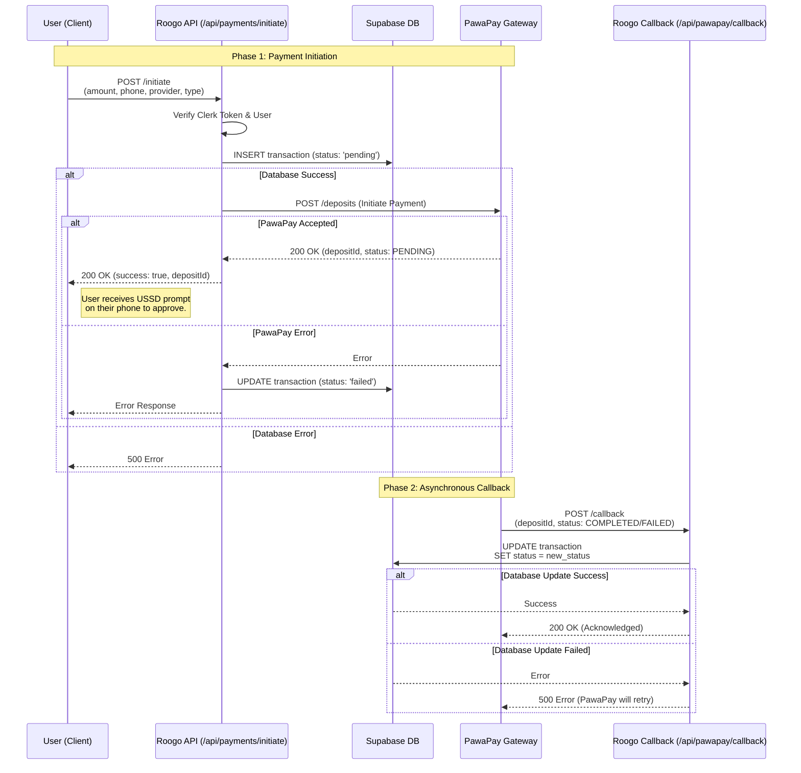

# Roogo Payment System Documentation

This document explains the payment flow integration with PawaPay for Mobile Money payments (Orange Money, Moov Money) in Burkina Faso.

www.roogobf.com/api/pawapay/callback

## Overview

The system handles payments for:

1.  **Property Listing Submissions**: Fees paid by owners to list properties.
2.  **Photography Services**: Fees for professional photography.

It supports **Deposits** (collecting money), **Payouts** (disbursing money), and **Refunds**.

The flow involves the Client (Web/App), Roogo API (Next.js), Supabase Database, and the PawaPay Gateway.

## Payment Flow Diagram

## Detailed Steps

### 1. Initiation (`/api/payments/initiate`)

1.  **Authentication**: The request must include a valid Clerk Bearer token.
2.  **User Verification**: The API resolves the Clerk ID to a User ID in Supabase.
3.  **Record Creation**: A transaction record is created in the `transactions` table with status `pending`. This ensures we track every attempt.
4.  **PawaPay Request**: The API sends a deposit request to PawaPay with:
    - `depositId`: A unique UUID generated by us.
    - `payerClientCode`: E.g., `ORANGE_MONEY_BFA`.
    - `payer.address.value`: The user's phone number.
    - `preAuthorisationCode` (Orange Burkina Faso only): An OTP generated by the user.
5.  **Response**: The client receives the `depositId` to track the payment locally if needed.

### 2. Processing (External)

- PawaPay communicates with the Mobile Money Operator (Orange/Moov).
- **Orange Money (Burkina Faso)**: The user must FIRST generate an OTP by dialing `*144*4*6#` on their phone and providing it to the app.
- **Moov Money**: The user receives a USSD push on their phone asking for PIN code approval.
- Once the user approves or rejects (or times out), the status is finalized.

### 3. Callback (`/api/pawapay/callback`)

This single endpoint handles callbacks for Deposits, Payouts, and Refunds.

- PawaPay sends a webhook to this endpoint when the transaction status changes.
- **Payload**: Contains `depositId` (or `payoutId` / `refundId`), `status` (COMPLETED, FAILED, etc.), and `failureReason`.
- **Action**: The API updates the corresponding record in the `transactions` table in Supabase using the ID.
- **Idempotency**: PawaPay may send the same callback multiple times; updating the status is safe.

### 4. Verification (Optional)

The client can poll `/api/payments/status` with the `depositId` to check the current status if real-time UI updates are required, although the callback ensures the backend system of record is always up to date.

## Other Operations

### Payouts

To disburse funds to a user (e.g. commission), use the Payouts API.

- **Endpoint**: `POST /payouts` (on PawaPay API)
- **Flow**: Similar to deposits, initiates a transfer to the user's mobile wallet.
- **Callback**: Received at the same `/api/pawapay/callback` URL. The payload will contain `payoutId`.

### Refunds

To refund a transaction.

- **Endpoint**: `POST /refunds` (on PawaPay API)
- **Callback**: Received at the same `/api/pawapay/callback` URL. The payload will contain `refundId`.

## Database Schema

The `transactions` table tracks all payments:

- `deposit_id`: Unique key linking to PawaPay (stores `depositId`, `payoutId`, or `refundId`).
- `status`: `pending`, `completed`, `failed`, `refunded`.
- `type`: `listing_submission` or `photography`.
- `user_id`: Link to the paying user.
- `property_id`: Link to the relevant property (if applicable).
- `metadata`: Stores the full raw response from PawaPay for debugging.

## Configuration

Ensure the following environment variables are set in `.env.local` and your deployment platform (Vercel):

- `PAWAPAY_API_TOKEN`: Your PawaPay API Token.
- `PAWAPAY_URL`: `https://api.sandbox.pawapay.cloud` (Sandbox) or Production URL.
- `CLERK_SECRET_KEY`: For verifying user tokens.
- `SUPABASE_URL` & `SUPABASE_SERVICE_ROLE_KEY`: For database access.

**Important**: In the PawaPay Dashboard, configure the Callback URLs for **Deposits**, **Payouts**, and **Refunds** to the same endpoint:
`https://<your-domain>/api/pawapay/callback`

## Sandbox Testing

### Test Phone Numbers

When testing in the PawaPay sandbox environment, use these specific numbers:

#### Orange Money (ORANGE_BFA)

- ✅ **22607345678** - Completes successfully
- ❌ **22607345128** - Gets stuck in SUBMITTED status (no callback) - DO NOT USE

#### Moov Money (MOOV_BFA)

- ✅ **22602345678** - Completes successfully

### Pre-authorisation Codes

For Orange Money in sandbox, any 6-digit code works (e.g., `666666`, `123456`).

### Important Notes

- The app will poll for payment status every 3 seconds for up to 60 seconds
- If using a number that gets stuck (like 22607345128), the app will timeout and notify the user
- Always use the recommended test numbers ending in `...5678` for successful completions
- In production, users must dial `*144*4*6#` to generate a real OTP for Orange Money
